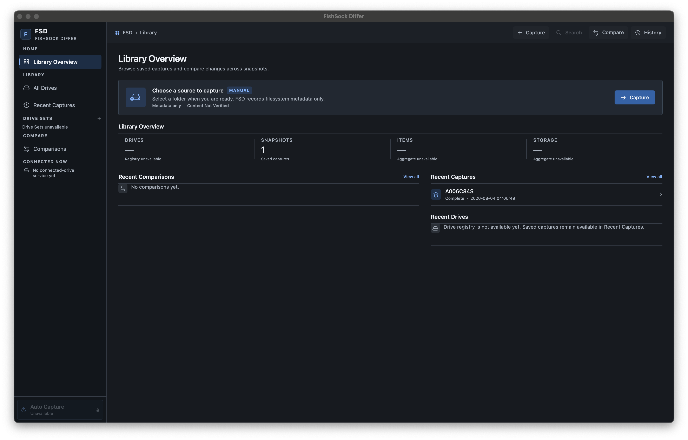
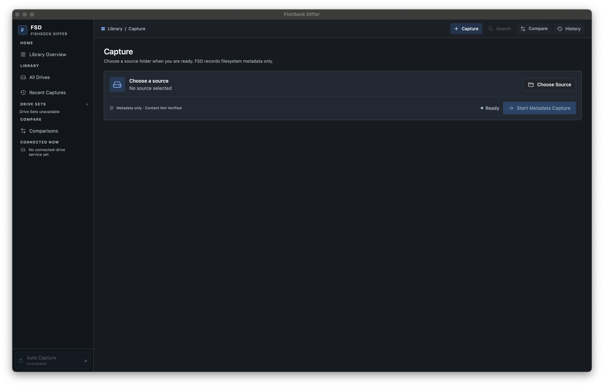
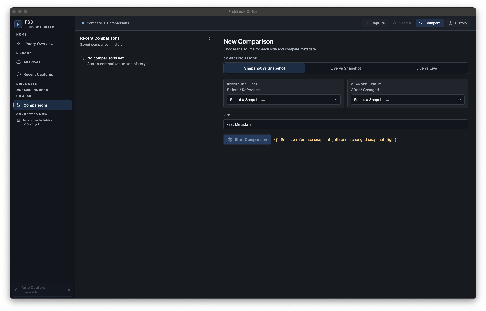
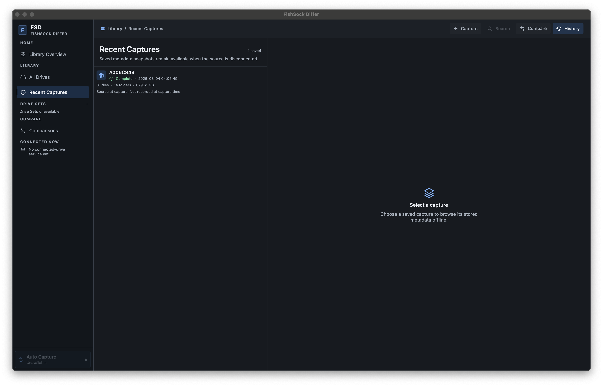

# FSD — FishSock Differ

**Remember the drive. Browse it later. Compare it. Find the change.**<br>
**Ghi nhớ ổ đĩa. Duyệt lại khi cần. So sánh. Tìm thay đổi.**

A native macOS tool for keeping filesystem metadata snapshots and comparing directory trees, built for DITs, data managers, editors and anyone working with removable storage.

Công cụ macOS native để lưu snapshot metadata của hệ thống file và so sánh cây thư mục, dành cho DIT, data manager, editor và người thường xuyên làm việc với ổ lưu trữ rời.

> **v0.1.0 · Build 1 · PRE-RELEASE / FIRST PUBLIC TEST**<br>
> **UNSIGNED · NOT NOTARIZED** — no Developer ID signature.<br>
> **BẢN THỬ NGHIỆM CÔNG KHAI ĐẦU TIÊN** — chưa ký Developer ID, chưa notarize.

## Overview / Tổng quan

FSD records names, relative paths, sizes, timestamps and other filesystem metadata. It **does not copy your file contents**. Completed snapshots remain browsable after the source drive or card is disconnected. Snapshots and comparison records are stored locally in the app's SQLite catalog.

FSD ghi lại tên, đường dẫn tương đối, kích thước, thời gian và metadata khác của hệ thống file. Ứng dụng **không sao chép nội dung file**. Snapshot hoàn tất vẫn duyệt được khi ổ đĩa hoặc thẻ nguồn đã ngắt kết nối. Snapshot và bản ghi so sánh được lưu cục bộ trong SQLite catalog của ứng dụng.

**Metadata Match · Content Not Verified.** A metadata match can hide different file contents. FSD is not a checksum verifier, copy engine or backup system.

**Metadata khớp · Nội dung chưa được kiểm chứng.** Hai file có metadata giống nhau vẫn có thể khác nội dung. FSD không phải công cụ kiểm tra checksum, sao chép hay backup.

## Current v0.1 capabilities / Tính năng v0.1

| Implemented / Đã có | Behavior / Cách hoạt động |
|---|---|
| Manual capture / Capture thủ công | Select a mounted source folder or volume and explicitly start metadata capture; progress and cancellation. / Chọn thư mục hoặc volume đã mount, chủ động bắt đầu capture metadata; có tiến độ và hủy. |
| Saved history / Lịch sử đã lưu | Completed and partial capture status, counts and capture-time source facts. / Trạng thái hoàn tất hoặc chưa đầy đủ, số lượng và thông tin nguồn tại thời điểm capture. |
| Offline browse / Duyệt offline | Lazy tree, selected-entry details and bounded name/path search within one snapshot. / Cây thư mục tải từng phần, chi tiết mục đang chọn và tìm tên/đường dẫn có giới hạn trong một snapshot. |
| Metadata compare / So sánh metadata | Snapshot ↔ snapshot, live ↔ snapshot and live ↔ live; profiles, outcome filters and next/previous difference navigation. / Ba chế độ so sánh; profile, lọc kết quả và chuyển tới khác biệt trước/sau. |
| Persistent snapshot comparisons / Lưu so sánh snapshot | Snapshot ↔ snapshot records can be reopened from Recent Comparisons. Live-side comparisons are workspace-scoped and disposed on close. / So sánh hai snapshot có thể mở lại; so sánh có nguồn live chỉ tồn tại trong workspace, được dọn khi đóng. |
| Snapshot JSON export / Xuất JSON snapshot | Metadata-only JSON from the snapshot browser; classification is excluded. / JSON chỉ chứa metadata từ trình duyệt snapshot; không chứa kết quả nhận diện loại file. |
| Detected File Type / Nhận diện loại file | Explicit action for one selected eligible file with its source available; bundled offline detector reads a small bounded sample. / Thao tác riêng cho một file đủ điều kiện đang chọn khi nguồn còn truy cập được; bộ nhận diện offline đi kèm đọc mẫu nhỏ có giới hạn. |

**Visible placeholders:** All Drives currently explains the missing per-drive library. Connected Now has no connected-drive backend. Drive Sets, Auto Capture and the toolbar's library-wide Search are unavailable. Their appearance in screenshots does not mean those features work. Use Recent Captures and search inside an opened snapshot.

**Các mục giao diện chưa hoạt động:** All Drives hiện thông báo thư viện theo từng ổ chưa có. Connected Now chưa có backend theo dõi ổ kết nối. Drive Sets, Auto Capture và Search toàn thư viện trên toolbar chưa khả dụng. Có mặt trong ảnh không có nghĩa tính năng đã chạy. Hãy dùng Recent Captures và tìm kiếm bên trong snapshot đã mở.

## Screenshots / Ảnh giao diện

These four accepted interface captures show the current app, including unavailable controls. Saved data shown is illustrative of an existing local catalog; it is not bundled with the download.

Bốn ảnh giao diện đã được duyệt thể hiện ứng dụng hiện tại, bao gồm các mục chưa khả dụng. Dữ liệu hiển thị thuộc catalog cục bộ có sẵn; bản tải về không kèm catalog đó.

### Library Overview / Tổng quan thư viện



Start from the library and navigate to Capture, Compare or History. / Bắt đầu từ thư viện và mở Capture, Compare hoặc History.

### Capture / Tạo snapshot



Choose a source, then start capture explicitly. / Chọn nguồn, sau đó chủ động bắt đầu capture.

### Compare / So sánh



Choose the mode, reference side, changed side and metadata profile. / Chọn chế độ, phía tham chiếu, phía thay đổi và metadata profile.

### Recent Captures / Lịch sử snapshot và duyệt offline



Select a saved capture to browse its stored metadata, including when the source is disconnected. / Chọn snapshot đã lưu để duyệt metadata, kể cả khi nguồn đã ngắt kết nối.

## Requirements / Yêu cầu hệ thống

- **macOS 15 Sequoia or later / macOS 15 Sequoia trở lên.**
- **Apple Silicon (arm64).** Intel builds are not provided. / Không cung cấp bản Intel.
- A source mounted and readable by macOS for capture or live comparison. / Nguồn đã mount và macOS đọc được để capture hoặc so sánh live.
- Local storage for the catalog and any exports. No Homebrew, Go or external classifier installation is needed to run the app. / Dung lượng cục bộ cho catalog và file xuất. Chạy ứng dụng không cần cài Homebrew, Go hay bộ nhận diện ngoài.

## Installation / Cài đặt

The public test download is distributed through [GitHub Releases](https://github.com/cenvu/FSD/releases) when published. Release details and the artifact checksum are in [v0.1.0 release notes](docs/releases/v0.1.0.md).

Bản thử nghiệm được cung cấp qua [GitHub Releases](https://github.com/cenvu/FSD/releases) khi phát hành. Chi tiết và checksum nằm trong [release notes v0.1.0](docs/releases/v0.1.0.md).

1. Download `FSD-v0.1.0-macOS15-arm64.zip` from the release. / Tải ZIP từ trang release.
2. Unzip it and move `FSD.app` to `/Applications` or `~/Applications`. / Giải nén và chuyển `FSD.app` vào một trong hai thư mục Applications.
3. Try opening the app normally. / Thử mở ứng dụng bình thường.
4. If macOS blocks it, right-click `FSD.app` → **Open** → **Open**. Alternatively, after the blocked attempt, use **System Settings → Privacy & Security → Open Anyway**, if macOS offers that option. / Nếu bị chặn, nhấp chuột phải → **Open** → **Open**; hoặc sau lần bị chặn, vào **System Settings → Privacy & Security → Open Anyway** nếu macOS hiển thị tùy chọn này.

This build is **UNSIGNED and NOT NOTARIZED**. macOS may block its first launch; the available prompts vary by OS version and security policy. If neither per-app approval is available, report the exact message. Keep Gatekeeper enabled and approve only the download you intended to test.

Bản này **chưa ký và chưa notarize**. macOS có thể chặn lần mở đầu; thông báo tùy phiên bản hệ điều hành và chính sách bảo mật. Nếu không có cách cho phép riêng ứng dụng, hãy báo nguyên văn thông báo lỗi. Giữ Gatekeeper hoạt động và chỉ cho phép đúng bản anh/chị muốn thử.

## Quick Start / Bắt đầu nhanh

1. Open FSD and choose **Capture**. / Mở FSD và chọn **Capture**.
2. Choose a small, readable folder and click **Start Metadata Capture**. / Chọn thư mục nhỏ, đọc được rồi bấm **Start Metadata Capture**.
3. Wait for Complete, then open **History / Recent Captures** and select the saved snapshot. / Chờ Complete, mở **History / Recent Captures** rồi chọn snapshot.
4. Disconnect the source and continue browsing the stored tree. / Ngắt kết nối nguồn và tiếp tục duyệt cây thư mục đã lưu.
5. Capture another state, then compare the two completed snapshots. / Capture trạng thái khác rồi so sánh hai snapshot hoàn tất.

## Capture / Tạo snapshot

Source selection and capture are manual. Capture records metadata only, without reading file payloads or modifying the source. Symlinks are recorded without traversal. The UI reports progress and allows cancellation. Completed capture facts are immutable; cancelled, interrupted or failed captures remain distinguishable and never replace the last complete snapshot.

Chọn nguồn và capture đều thủ công. Capture chỉ ghi metadata, không đọc nội dung hay sửa nguồn. Symlink được ghi nhận nhưng không duyệt theo liên kết. Giao diện có tiến độ và hủy. Dữ kiện snapshot hoàn tất không bị sửa; capture bị hủy, gián đoạn hoặc lỗi được phân biệt rõ và không thay thế snapshot hoàn tất gần nhất.

A capture spans a time interval, not an atomic disk image. Prefer a quiet source and review any warnings before interpreting comparison results.

Capture diễn ra trong một khoảng thời gian, không phải ảnh đĩa nguyên tử. Nên dùng nguồn ít thay đổi và xem cảnh báo trước khi diễn giải kết quả so sánh.

## History & Offline Browse / Lịch sử & duyệt offline

Use **History** or **Recent Captures**, select a snapshot, expand folders and inspect recorded details. Searching an opened snapshot uses stored names/relative paths and bounded results. Offline browsing does not restore files or open their missing contents. Reconnect the source before requesting new file-type detection.

Dùng **History** hoặc **Recent Captures**, chọn snapshot, mở thư mục và xem chi tiết đã ghi. Tìm kiếm trong snapshot dùng tên/đường dẫn tương đối đã lưu với kết quả có giới hạn. Duyệt offline không khôi phục file hay mở nội dung đã vắng mặt. Kết nối lại nguồn trước khi yêu cầu nhận diện loại file mới.

## Compare / So sánh

The **left side is Before / Reference**; the **right side is After / Changed**. Added means present only on the right; Removed means present only on the left. Uncertain results and key collisions do not establish a deterministic match.

**Bên trái là Before / Reference**; **bên phải là After / Changed**. Added là chỉ có bên phải; Removed là chỉ có bên trái. Kết quả Uncertain và trùng khóa không chứng minh được sự khớp chắc chắn.

| Profile | Compared metadata / Metadata được so sánh |
|---|---|
| Fast Metadata | Relative path, item type, logical size; ignores timestamps and common macOS service files. / Đường dẫn tương đối, loại mục, kích thước logic; bỏ qua thời gian và file dịch vụ macOS phổ biến. |
| Structure Only | Relative path and item type. / Đường dẫn tương đối và loại mục. |
| Strict Metadata | Adds modification time; creation time depends on the profile. / Thêm thời gian sửa đổi; thời gian tạo tùy profile. |

Snapshot ↔ snapshot comparisons persist locally. Live ↔ snapshot and live ↔ live first capture live inputs into temporary metadata snapshots. Those inputs stay out of capture history; closing the workspace disposes the live comparison and temporary evidence. Abandoned live work is cleaned up at the next launch. To keep a comparison for later, manually capture both sources and compare the saved snapshots.

So sánh snapshot ↔ snapshot được lưu cục bộ. Live ↔ snapshot và live ↔ live capture nguồn live thành snapshot metadata tạm. Chúng không xuất hiện trong lịch sử capture; đóng workspace sẽ dọn so sánh live và dữ liệu tạm. Công việc live bỏ dở được dọn ở lần mở ứng dụng sau. Muốn giữ kết quả để xem lại, hãy capture thủ công cả hai nguồn rồi so sánh snapshot đã lưu.

Use outcome filters and next/previous difference controls. **Content Not Verified** applies to every profile, including Strict Metadata.

Dùng bộ lọc kết quả và nút khác biệt trước/sau. **Content Not Verified** áp dụng cho mọi profile, kể cả Strict Metadata.

## Safety model / Nguyên tắc an toàn

- Sources are read-only from FSD: no source copy, move, rename, delete, markers or source-side catalog writes. / FSD chỉ đọc nguồn: không sao chép, di chuyển, đổi tên, xóa, tạo marker hay ghi catalog lên nguồn.
- Ordinary capture, browse, search, compare and JSON export do not trigger classification. / Capture, duyệt, tìm kiếm, so sánh và xuất JSON thông thường không tự kích hoạt nhận diện loại file.
- Completed snapshots stay immutable; partial evidence never claims completeness. / Snapshot hoàn tất không bị sửa; dữ liệu chưa đầy đủ không được coi là hoàn tất.
- Metadata equality is not proof of equal bytes or a safe backup. / Metadata giống nhau không chứng minh nội dung giống nhau hay backup an toàn.

## Detected File Type / Nhận diện loại file

In an opened snapshot, select an eligible regular file and click **Classify selected file** in the inspector to request file-type detection while the source is available. The bundled offline filetype detector examines **one prefix of at most 4,096 bytes**; a small file may fit entirely in that sample. There is no automatic or bulk classification. Sample bytes are not stored, hashed or logged.

Trong snapshot đã mở, chọn file thường đủ điều kiện và bấm **Classify selected file** trong inspector để yêu cầu nhận diện khi nguồn còn truy cập được. Bộ nhận diện filetype offline đi kèm xem **một đoạn đầu tối đa 4.096 byte**; file nhỏ có thể nằm trọn trong mẫu. Không có nhận diện tự động hoặc hàng loạt. Byte mẫu không được lưu, hash hay ghi log.

Detection describes current source bytes at the time of the action. It does not verify historical content or alter snapshot/comparison truth. Unrecognized input may show **No file type recognized** and leave the persistent inspector **Not classified**. No universal accuracy or legacy DOC/XLS/PPT determinism is promised.

Nhận diện mô tả byte nguồn hiện tại tại thời điểm thao tác. Nó không kiểm chứng nội dung lịch sử hay thay đổi dữ kiện snapshot/so sánh. Mẫu không nhận ra có thể báo **No file type recognized** và để inspector ở **Not classified**. Không cam kết độ chính xác mọi loại file hay tính xác định chung cho DOC/XLS/PPT cũ.

## Known limitations / Giới hạn hiện tại

- First public test; keep independent backups of important files and your catalog. / Bản thử công khai đầu tiên; giữ backup độc lập cho file quan trọng và catalog.
- No automatic mount detection, Auto Capture, Drive Sets, strong physical-drive identity service or library-wide search. / Chưa có tự phát hiện mount, Auto Capture, Drive Sets, nhận dạng ổ vật lý mạnh hay tìm toàn thư viện.
- No HTML or comparison-report export; JSON export currently covers snapshots. / Chưa xuất HTML hay báo cáo so sánh; JSON hiện dành cho snapshot.
- No content hashing, verification, cloud sync or multi-Library. / Không có hash nội dung, kiểm chứng nội dung, cloud sync hay multi-Library.
- Capture is limited to sources readable through the mounted native path. Embedded ext2/3/4 readers and raw-device access are not integrated into production. Stock-macOS NTFS validation is environment-blocked; network volumes are experimental. / Capture dùng nguồn đọc được qua đường dẫn đã mount. Reader ext2/3/4 và truy cập raw-device chưa tích hợp production. Kiểm chứng NTFS trên macOS nguyên bản bị giới hạn môi trường; volume mạng còn thử nghiệm.
- Missing metadata, changing sources, filesystem timestamp precision and ambiguous identities limit conclusions. Display names or mount paths alone do not establish physical-drive identity. / Metadata thiếu, nguồn thay đổi, độ chính xác thời gian và danh tính mơ hồ giới hạn kết luận. Tên hiển thị hoặc mount path không đủ nhận dạng ổ vật lý.
- Important snapshots captured before the August 4, 2026 scanner correction should be recaptured: an older defect could omit a sibling subtree. / Nên capture lại snapshot quan trọng có trước bản sửa scanner ngày 04/08/2026: lỗi cũ có thể bỏ sót cây thư mục cùng cấp.
- The native macOS titlebar may remain system-gray. VoiceOver and physical-media acceptance are still deferred. / Titlebar native có thể vẫn xám hệ thống. Kiểm chứng VoiceOver và nghiệm thu trên media vật lý vẫn chưa thực hiện.
- No Developer ID signing, notarization or App Store readiness. / Chưa ký Developer ID, chưa notarize, chưa tuyên bố sẵn sàng App Store.

## Build from source / Build từ source

Use Xcode with the macOS 15+ SDK and command-line tools on Apple Silicon. Open `FSD.xcodeproj` and select the **FSD** scheme, or run from the repository root:

Dùng Xcode có macOS 15+ SDK và command-line tools trên Apple Silicon. Mở `FSD.xcodeproj`, chọn scheme **FSD**, hoặc chạy tại thư mục gốc repository:

```sh
xcodebuild -project FSD.xcodeproj -scheme FSD \
  -configuration Release -destination 'platform=macOS,arch=arm64' \
  -derivedDataPath .ai-scratch/public-build clean build
```

The app is at `.ai-scratch/public-build/Build/Products/Release/FSD.app`. Normal Xcode builds use the committed helper and bundled notices; they do not rebuild the helper or require Go/module downloads. Signing is disabled (`CODE_SIGNING_ALLOWED=NO`). Do not re-sign the helper as part of this release's packaging.

Ứng dụng nằm tại `.ai-scratch/public-build/Build/Products/Release/FSD.app`. Build Xcode thông thường dùng helper và notices đã commit; không build lại helper hay tải Go/module. Signing đã tắt (`CODE_SIGNING_ALLOWED=NO`). Không ký lại helper khi đóng gói bản này.

To run the current XCTest suite / Chạy XCTest suite hiện tại:

```sh
xcodebuild -project FSD.xcodeproj -scheme FSD \
  -configuration Debug -destination 'platform=macOS,arch=arm64' \
  -derivedDataPath .ai-scratch/public-tests test
```

Tests isolate their catalogs from the normal application catalog. Some external-filesystem/probe tests require separately prepared environments and skip when absent. / Test dùng catalog riêng. Một số test filesystem/probe ngoài cần môi trường chuẩn bị riêng và skip khi không có.

## Privacy / Quyền riêng tư

The default catalog is `~/Library/Application Support/FSD/catalog.sqlite3`. FSD has no runtime cloud sync, analytics or classifier network dependency. Names, directory structure, sizes, timestamps and recorded source facts can still be sensitive. JSON exports and screenshots can reveal that metadata: review them before sharing. The ZIP contains the app and resources, not your local catalog. Back up the catalog with FSD closed; do not sync an open SQLite catalog through a cloud folder.

Catalog mặc định là `~/Library/Application Support/FSD/catalog.sqlite3`. FSD không có cloud sync, analytics hay phụ thuộc mạng để nhận diện loại file lúc chạy. Tên, cấu trúc thư mục, kích thước, thời gian và thông tin nguồn vẫn có thể nhạy cảm. JSON và ảnh giao diện có thể lộ metadata: kiểm tra trước khi chia sẻ. ZIP chứa ứng dụng và tài nguyên, không chứa catalog của người dùng. Backup catalog khi FSD đã đóng; không sync SQLite catalog đang mở qua thư mục cloud.

## Third-party notices / Thông báo bên thứ ba

The helper's [THIRD_PARTY_NOTICES.txt](FSD/Helpers/THIRD_PARTY_NOTICES.txt) includes filetype v1.1.3 (MIT), the Go runtime license and patent notice, and the linked Sun Microsystems math notice. The same notice file is bundled at `FSD.app/Contents/Resources/THIRD_PARTY_NOTICES.txt`. Third-party components retain their own licenses.

[THIRD_PARTY_NOTICES.txt](FSD/Helpers/THIRD_PARTY_NOTICES.txt) của helper gồm filetype v1.1.3 (MIT), license và patent notice của Go runtime, cùng notice của mã toán Sun Microsystems được liên kết. Cùng file notice được đóng gói tại `FSD.app/Contents/Resources/THIRD_PARTY_NOTICES.txt`. Thành phần bên thứ ba giữ license riêng.

The [dependency review](docs/DEPENDENCY_AND_LICENSE_REVIEW.md) also documents filesystem-reader research and candidates; it is not an inventory of libraries shipped in this release. / [Dependency review](docs/DEPENDENCY_AND_LICENSE_REVIEW.md) còn ghi nghiên cứu/candidate reader filesystem; không phải danh sách thư viện được ship trong bản này.

## License status / Trạng thái license

The source is publicly visible for testing/reference. **No open-source license is granted unless a `LICENSE` file is added later.** Third-party components retain their own licenses. Public visibility alone is not an open-source license grant for FSD's source.

Source được công khai để thử nghiệm/tham khảo. **Không cấp open-source license trừ khi file `LICENSE` được bổ sung sau này.** Thành phần bên thứ ba giữ license riêng. Việc source nhìn thấy công khai không tự cấp open-source license cho source FSD.

## Feedback / Issues / Góp ý & báo lỗi

Use [GitHub Issues](https://github.com/cenvu/FSD/issues). Include macOS version, Mac model, FSD version/build, filesystem, exact steps, expected/actual behavior and whether the source was connected. For compare issues, include mode/profile and left/right orientation. Redact private names, paths and project data from screenshots, logs and exports; do not upload your whole catalog or original media.

Báo tại [GitHub Issues](https://github.com/cenvu/FSD/issues): phiên bản macOS, model Mac, version/build FSD, filesystem, bước tái hiện, kết quả mong đợi/thực tế và nguồn có kết nối hay không. Với lỗi so sánh, thêm mode/profile và thứ tự trái/phải. Che tên, đường dẫn và dữ liệu dự án riêng trong ảnh, log và file xuất; không tải toàn bộ catalog hay media gốc lên.
